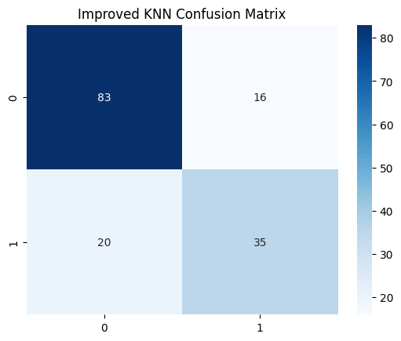
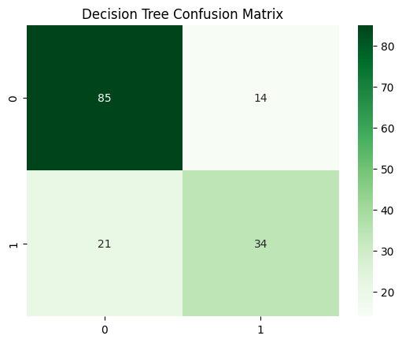
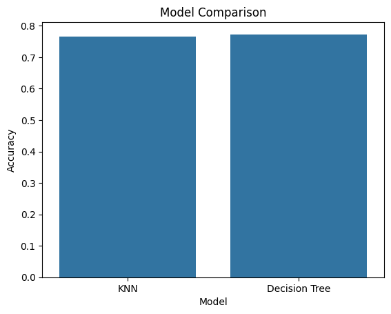

# Pima Indians Diabetes Classification Mini Project

This project constructs classification models on the Pima Indians Diabetes dataset from the UCI Repository. The goal is to predict whether a patient is diabetic or not diabetic using two supervised machine learning algorithms:

- K-Nearest Neighbors (KNN)
- Decision Tree

The models are evaluated using accuracy and confusion matrix.

## Problem Statement

Construct a classification model on the Pima Indians Diabetes dataset using KNN and Decision Tree algorithms. Evaluate both models using accuracy and confusion matrix, then compare their performance.

Diabetes is a long-term medical condition related to high blood glucose levels. Early prediction can support timely medical attention and lifestyle changes. In this project, machine learning is used to classify patients based on medical attributes such as glucose level, blood pressure, BMI, insulin, age, and diabetes pedigree function.

## Aim of the Project

The main aims of this mini project are:

- To understand the Pima Indians Diabetes dataset.
- To preprocess the dataset before model training.
- To build a KNN classification model.
- To build a Decision Tree classification model.
- To evaluate both models using accuracy and confusion matrix.
- To compare the performance of KNN and Decision Tree.

## Project Directory

```text
ML_Diabetes_Project/
│
├── README.md
│
├── notebook/
│   ├── diabetes.csv
│   └── diabetes_model.ipynb
│
└── report/
```

## Directory Explanation

`README.md` contains the project overview, problem statement, algorithm explanation, implementation summary, and report structure.

`notebook/diabetes.csv` is the dataset used for training and testing the models.

`notebook/diabetes_model.ipynb` contains the complete Jupyter Notebook implementation with markdown explanations for each code cell.

`report/` can be used to store the final report document and screenshots.

## Dataset Description

The dataset contains medical diagnostic measurements for patients. The target column is `Outcome`.

| Column | Description |
| --- | --- |
| Pregnancies | Number of pregnancies |
| Glucose | Plasma glucose concentration |
| BloodPressure | Diastolic blood pressure |
| SkinThickness | Triceps skin fold thickness |
| Insulin | Serum insulin level |
| BMI | Body Mass Index |
| DiabetesPedigreeFunction | Diabetes hereditary likelihood score |
| Age | Patient age |
| Outcome | Target value: `0` = Not Diabetic, `1` = Diabetic |

## Algorithms Used

### K-Nearest Neighbors

KNN is a supervised classification algorithm that predicts the class of a new data point based on the majority class of its nearest neighbors. Since KNN uses distance calculations, feature scaling is important. In this project, `StandardScaler` is used before training the KNN model.

### Decision Tree

A Decision Tree is a supervised learning algorithm that makes predictions using a tree-like structure of decision rules. It splits the dataset based on feature values and creates branches until a class prediction can be made. Decision Trees are easy to understand and useful for classification problems.

## Implementation Summary

The notebook follows these steps:

1. Import required libraries.
2. Load the Pima Indians Diabetes dataset.
3. Display dataset shape and first few records.
4. Show dataset information and statistical summary.
5. Check the class distribution of the `Outcome` column.
6. Replace invalid zero values in selected medical columns with median values.
7. Split the dataset into features and target.
8. Split the data into training and testing sets.
9. Scale features for the KNN model.
10. Train the KNN classifier.
11. Evaluate KNN using accuracy and confusion matrix.
12. Train the Decision Tree classifier.
13. Evaluate Decision Tree using accuracy and confusion matrix.
14. Compare KNN and Decision Tree accuracy.
15. Test both models on sample patient data.

## Evaluation Metrics

### Accuracy

Accuracy measures how many total predictions were correct.

```text
Accuracy = Correct Predictions / Total Predictions
```

### Confusion Matrix

A confusion matrix shows how many predictions were correct and incorrect for each class.

For this project, it shows:

- True negatives: correctly predicted not diabetic cases.
- False positives: not diabetic cases predicted as diabetic.
- False negatives: diabetic cases predicted as not diabetic.
- True positives: correctly predicted diabetic cases.

## How to Run the Project

1. Open the project folder.
2. Open `notebook/diabetes_model.ipynb` in Jupyter Notebook, JupyterLab, or VS Code.
3. Install the required libraries if needed:

```bash
pip install pandas numpy matplotlib seaborn scikit-learn jupyter
```

4. Run all notebook cells from top to bottom.
5. Use the generated dataset preview, accuracy values, confusion matrices, and comparison graph in the final report.

## Report Structure

### Chapter 1: Introduction

Include:

- Brief introduction to machine learning.
- Aim of the mini project.
- Introduction to the Pima Indians Diabetes dataset.
- Introduction to KNN and Decision Tree algorithms.
- Explanation of the problem statement.

### Chapter 2: Implementation

Include:

- Complete code from `notebook/diabetes_model.ipynb`.
- Screenshot of the dataset preview using `df.head()`.
- Explanation of preprocessing steps.
- Explanation of train-test split.
- Explanation of KNN implementation.
- Explanation of Decision Tree implementation.

### Chapter 3: Results

Include screenshots of:

- KNN accuracy output.
- KNN confusion matrix.
- Decision Tree accuracy output.
- Decision Tree confusion matrix.
- Accuracy comparison table.
- Accuracy comparison graph.

Also include a short comparison explaining which model achieved better accuracy.

### Chapter 4: Conclusion

Summarize:

- What was implemented.
- Which algorithms were used.
- How the models were evaluated.
- Which model performed better based on accuracy and confusion matrix.
- Possible future improvements, such as using cross-validation, hyperparameter tuning, or testing additional algorithms.

## Notebook Markdown Explanation

Each code cell in the notebook has a markdown cell above it explaining what the code does. These markdown explanations can be reused while writing the implementation and results chapters of the report.

## Expected Output





After running the notebook, the project will generate:

- Dataset preview and summary.
- Class distribution chart.
- KNN accuracy score.
- KNN confusion matrix.
- Decision Tree accuracy score.
- Decision Tree confusion matrix.
- Accuracy comparison table.
- Accuracy comparison bar chart.
- Sample patient prediction output.

## Conclusion

This project demonstrates how KNN and Decision Tree classifiers can be used to predict diabetes from medical data. Both models are trained and tested on the same dataset, then compared using accuracy and confusion matrix results.
